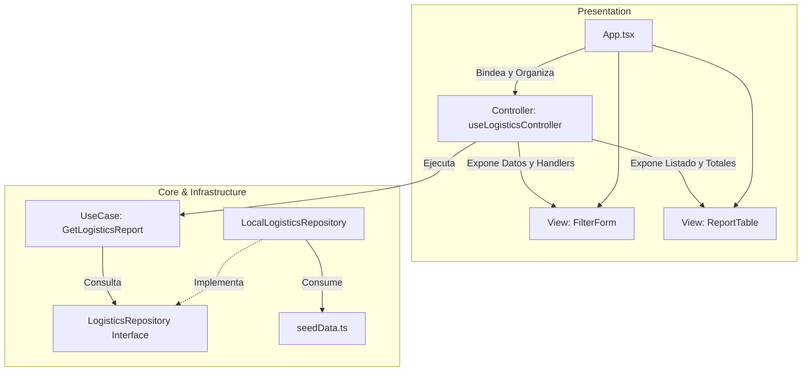

# 📦 Mini Core: Gestión de Costos de Distribución

Este proyecto es una aplicación web funcional desarrollada en **React 19**, **TypeScript** y **Tailwind CSS v4** utilizando la herramienta de empaquetado **Vite**. Está diseñada bajo los principios de **Clean Architecture** (Arquitectura Limpia) y el patrón **MVC** (Modelo-Vista-Controlador), ofreciendo una separación estricta de responsabilidades, tipado estricto, y código altamente testeable y desacoplado del framework.

La aplicación resuelve un problema de logística fundamental: **Calcular el costo total de los envíos por repartidor dentro de un rango de fechas, aplicando una tarifa por kilogramo definida según la zona de entrega.**

---

## 🎥 Video Demostrativo y Explicativo
Puedes ver la explicación de la arquitectura y la demostración funcional en el siguiente enlace:
👉 [Ver Video de Demostración en YouTube](https://youtu.be/Z1_xONGu6pc)

---

## 🏗️ Arquitectura y Patrones de Diseño

La estructura del proyecto está organizada para asegurar un desacoplamiento completo de la lógica de negocio pura frente al framework visual y los datos de infraestructura.

### 1. Clean Architecture (Arquitectura Limpia)

*   **Domain (Capa de Dominio)**: Contiene la lógica de negocio pura y abstracta de la aplicación. No tiene dependencias de React ni de librerías externas.
    *   *Entities*: Modelos conceptuales (`Repartidor`, `Envio`, `Zona`, `ReporteLine`).
    *   *Repositories*: Definición de contratos (interfaces) de acceso a datos (`LogisticsRepository`).
*   **Use Cases (Capa de Casos de Uso)**: Contiene las reglas del negocio de la aplicación (`GetLogisticsReportUseCase`). Consume el repositorio para obtener los datos brutos, realiza el filtrado de fechas inclusivo, calcula la tarifa ($peso \times tarifa$) y agrupa los consolidados por repartidor.
*   **Infrastructure (Capa de Infraestructura)**: Implementa los contratos definidos en el dominio y provee datos al sistema.
    *   *Data*: Define el seed data estático (`seedData.ts`) con registros de validación para Mayo de 2025.
    *   *Repositories*: Implementa de forma asíncrona la obtención de datos (`LocalLogisticsRepository`).
*   **Presentation (Capa de Presentación)**: El sistema visual web desarrollado con React.

### 2. Patrón MVC (Modelo-Vista-Controlador) en React

Para estructurar los componentes de React de manera limpia y mantenible, aplicamos una separación clásica de MVC:



*   **Model (Modelo)**: Representado por las entidades del dominio y el caso de uso que procesa la lógica de cálculo y consolidación.
*   **Controller (Controlador)**: Implementado mediante el React Custom Hook [`useLogisticsController`](file:///c:/Users/ASUS%20TUF%20F15/Desktop/Uni/WEB%20TRABAJOS/minicore/src/presentation/controllers/useLogisticsController.ts). Maneja los estados del formulario, gestiona errores de validación (por ejemplo, si la fecha de inicio es posterior a la de fin), invoca el caso de uso y expone los resultados procesados listos a las vistas.
*   **View (Vista)**: Componentes funcionales puros de React ([`FilterForm`](file:///c:/Users/ASUS%20TUF%20F15/Desktop/Uni/WEB%20TRABAJOS/minicore/src/presentation/components/FilterForm.tsx), [`ReportTable`](file:///c:/Users/ASUS%20TUF%20F15/Desktop/Uni/WEB%20TRABAJOS/minicore/src/presentation/components/ReportTable.tsx)). No contienen lógica de negocio compleja ni instanciación de repositorios; solo renderizan la interfaz en base a los props que reciben.

---

## 📊 Estructura del Modelo de Datos (Seed Data)

El archivo de infraestructura [`seedData.ts`](file:///c:/Users/ASUS%20TUF%20F15/Desktop/Uni/WEB%20TRABAJOS/minicore/src/infrastructure/data/seedData.ts) define la estructura de las tres tablas conceptuales:

### 1. Repartidores
| id_repartidor (PK) | nombre | email |
| :--- | :--- | :--- |
| `1` | Andrés Mendoza | andres.mendoza@logistics.com |
| `2` | Camila Rojas | camila.rojas@logistics.com |
| `3` | Luis Delgado | luis.delgado@logistics.com |

### 2. Zonas de Entrega
| id_zona (PK) | nombre_zona | tarifa_por_kg (USD) |
| :--- | :--- | :--- |
| `1` | Zona Norte | `$1.50` |
| `2` | Zona Sur | `$2.00` |
| `3` | Zona Centro | `$1.75` |

### 3. Envíos (Shipments)
*   **Mayo 2025**:
    *   *Andrés Mendoza*: 3 envíos distribuidos entre Zona Norte y Centro (Total acumulado: **35.50 kg**, Costo: **$57.00**).
    *   *Camila Rojas*: 2 envíos en la Zona Sur (Total acumulado: **25.50 kg**, Costo: **$51.00**).
    *   *Luis Delgado*: **0 envíos** registrados en el período de Mayo 2025.
*   **Fuera del rango (Junio 2025)**:
    *   Contiene envíos de validación para testear que el filtro de rango inclusivo de fechas descarte correctamente registros externos.

---

## 📂 Estructura de Archivos del Proyecto

El código fuente está estructurado bajo el directorio `src/` de la siguiente forma:

```
src/
├── core/
│   ├── domain/
│   │   ├── entities/
│   │   │   ├── Repartidor.ts
│   │   │   ├── Envio.ts
│   │   │   ├── Zona.ts
│   │   │   └── ReporteLine.ts
│   │   └── repositories/
│   │       └── LogisticsRepository.ts
│   └── useCases/
│       ├── GetLogisticsReport.ts
│       └── GetLogisticsReport.test.ts
├── infrastructure/
│   ├── data/
│   │   └── seedData.ts
│   └── repositories/
│       └── LocalLogisticsRepository.ts
└── presentation/
    ├── components/
    │   ├── FilterForm.tsx
    │   └── ReportTable.tsx
    ├── controllers/
    │   └── useLogisticsController.ts
    ├── App.tsx
    ├── index.css
    └── main.tsx
```

---

## 🚀 Instalación y Ejecución Local

Sigue los siguientes pasos para instalar las dependencias, correr las pruebas y levantar la aplicación en tu entorno local:

### Prerrequisitos
*   Node.js (versión 18 o superior recomendada)
*   NPM (viene instalado por defecto con Node.js)

### 1. Clonar el repositorio e instalar dependencias
```bash
# Instalar los paquetes definidos
npm install
```

### 2. Ejecutar la Suite de Pruebas (Vitest)
El proyecto cuenta con una robusta suite de pruebas unitarias que evalúan las reglas del caso de uso. Puedes ejecutarlas con:
```bash
# Correr los tests una única vez
npm run test
# O alternativamente con watch activo
npx vitest
```

Las pruebas validan:
*   Filtro inclusivo por rango de fechas.
*   Cálculo exacto de costos por peso y tarifa.
*   Agrupación correcta de couriers sin envíos (reflejando **$0.00 / No aplica**).

### 3. Ejecutar el Servidor de Desarrollo
```bash
npm run dev
```
Abre en tu navegador [http://localhost:5173](http://localhost:5173) para ver e interactuar con la aplicación.

### 4. Compilar para Producción
Para validar que el código compile sin errores de tipado o de empaquetado:
```bash
npm run build
```

---

## ☁️ Despliegue en Vercel

Esta aplicación está completamente optimizada para ser desplegada en **Vercel** con un solo clic.

### Pasos para Desplegar:
1.  Inicia sesión en [Vercel](https://vercel.com).
2.  Haz clic en **"Add New"** y luego en **"Project"**.
3.  Importa este repositorio desde tu cuenta de GitHub (`Santty111/minicoree`).
4.  Vercel detectará automáticamente la configuración de **Vite**:
    *   **Framework Preset**: Vite
    *   **Build Command**: `tsc -b && vite build`
    *   **Output Directory**: `dist`
5.  Haz clic en **"Deploy"** y la aplicación estará lista en pocos segundos con SSL e integración continua de producción.